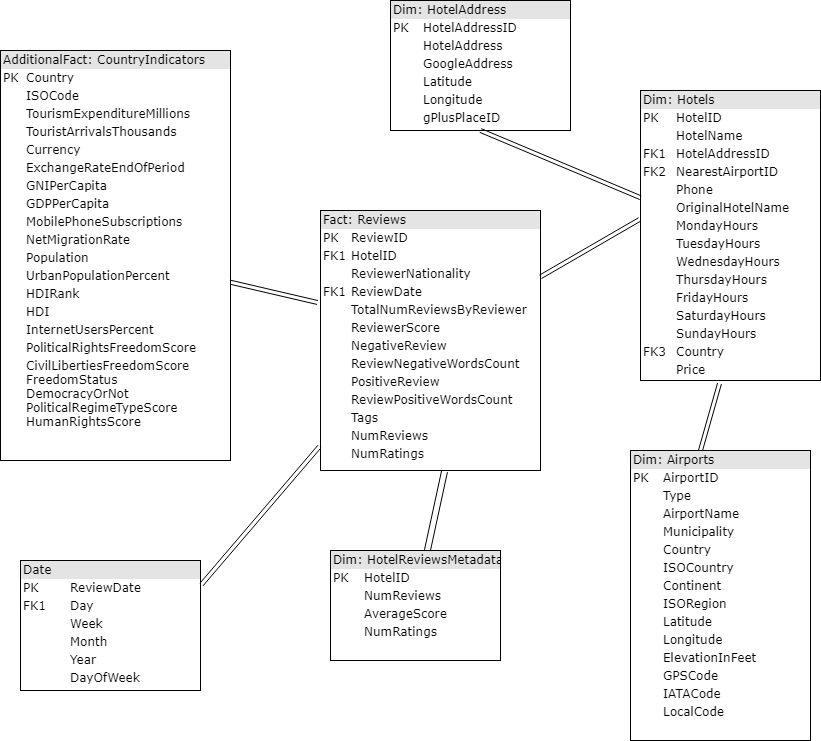

# Hotel reviews and geographical, demographic, economic data
### Data Engineering Capstone Project (done as part of Udacity Data Engineering Nanodegree)

#### Project Summary
This is a data engineering (ETL) project to combine data related to hotels from disparate sources, while also adding some additional data to enable some different kinds of analyses. The data sets used (explained in detail in the next section) include hotel review data scraped from Booking.com (with some sentiment analysis features included), data from Google maps, airport data, and tourism, economic, financial and political data from UN Agencies and a few other sources. A number of analyses can be done: based on reviewers' nationalities (and some political/economic/ indicators of their nationalities), on the hotel country (and its connection with the reviewers' nationality), on the number of reviews for a hotel, number of ratings, and so on.  For this project, the tools used are Apache Spark (Pyspark), Pandas, Amazon S3 and Amazon Redshift. 

Please also see the Capstone Project Walkthrough.ipynb notebook, which I use to provide a walkthrough of the whole project, to describe the data sets and data model, and to add more information about the project. The DataDictionary.pdf file contains the data dictionary.

Most of the heavy lifting is done in other Jupyter notebooks and in the RedshiftLoad/ folder. The main notebooks are CleanGooglePlaces.ipynb, PrepareDataSetsForS3.ipynb (this is the most important notebook in this project) and CombineAdditionalCountryData.ipynb. There are additional notebooks for data exploration in the DataExploration/ folder. Finally, the Redshift/ folder contains the code to stage and insert the data into the final tables (from S3, which is where we put our data at the end of PrepareDataSetsForS3).

### Step 1: Scope the Project and Gather Data

#### Scope 

### The main goals of my project are: 
1. to get a data set of hotel reviews in Europe and supplement it with data from Google Maps (Google Local). This will create a much richer data set as it would allow us to utilise things like the working hours of the hotel.
2. to add in information about the nearest airport to our hotels.
3. the original reviews data set is meant for sentiment analysis. I want to enable the end user to do many more kinds of analyses. I use data from the UN and other agencies about countries (both hotels' countries and the reviewer's countries) to allow additional analyses to see if there are patterns in reviews based on reviewers' nationality and its relation to the country where the hotel is located. For this, I use tourism data, economic, political and demographic data to see if these indicators of a country's economic and general well-being has an effect on its citizens' reviews. For example, do people from countries with low GDP tend to review hotels in countires with high GDP more favourably? See the CombineAdditionalCountryData.ipynb notebook for a lot more information about the type of analyses which can be made)  

4. to build a dimensional model with a central 'reviews' factless fact table and dimensions related to hotels, airports, addresses and time. An additional fact table containing various measures related to countries will also be present.

### Overview of end solution and tools used

I use the following tools:
1. Apache Spark: to clean and prepare the data sets. It takes care of the Extract and Transform steps of the ETL pipeline. Spark is a good tool for this because not only does it handle large amounts of data easily, but it also allows extremely powerful data manipulation. The primary data sets of this project (reviews, Google local and Airport codes) cannot be joined directly on any field. We need a fuzzy match for the location data, which is easier to do in Spark than in SQL. The process to prepare the data is very complicated (as you can see in the PrepareDataSetsForS3.ipynb notebook), so Spark plays a massive role in this project. In summary, Spark is used to prepare clean  data sets so that they're ready to be staged in S3 and then Redshift.
2. Pandas: the additional country data sets are wrangled, cleaned and combined using Pandas. These data sets are from the UN, IMF, UNDP, UNWTO, Freedom House and Our World in Data. I used Pandas because these data sets are quite small, and Pandas is an excellent and efficient solution when the data isn't too large.
3. Amazon S3: all the prepared data sets are stored in S3 in Apache Parquet format. S3 can be thought of as a staging area in this project, as an intermediate location between Spark (extract, transform) and Redshift (load).
4. Redshift: the final data warehouse is stored in Amazon Redshift. Redshift takes care of the Load part of the ETL pipeline. Staging tables are created with data loaded in from S3 (data which has been prepared using Spark and Pandas), and these are used to load the final data warehouse fact and dimension tables.

### Data used

The data sets used are described in some detail below. I have included a table with the number of rows in each data set and some additional details at the end of this section. 

1. **[515k Hotel Reviews in Europe](https://www.kaggle.com/jiashenliu/515k-hotel-reviews-data-in-europe "Kaggle 515k reviews")**: 
This data set by Jiashen Liu from 2017 contains European hotel review data scraped from Booking.com. The data set was originally created mainly for sentiment analysis, and contains fields such as positive and negative words in the reviews. Other interesting fields in terms of this project are GPS (which I will use to join to data sets 2 and 3 below), address and reviewers' nationality (which I will use to join some additional data sets -- data sets 4-16). 

The complete list of fields (taken mostly from the Kaggle page, but with some additional explanation by me) is given below:
* Hotel_Address: Address of hotel. This is not separated into country, city etc, and is sometimes random
* Review_Date: Date when reviewer posted the corresponding review.
* Average_Score: Average Score of the hotel, calculated based on the latest comment in the last year.
* Hotel_Name: Name of Hotel
* Reviewer_Nationality: Nationality of Reviewer
* Negative_Review: Negative part of the review. If the reviewer does not give a negative review, then the value should be 'No Negative'.
* ReviewTotalNegativeWordCounts: Total number of words in the negative review.
* Positive_Review: Positive part of the review. If the reviewer does not give a negative review, then the value should be: 'No Positive'.
* ReviewTotalPositiveWordCounts: Total number of words in the positive review.
* Reviewer_Score: Score the reviewer has given to the hotel, based on his/her experience
* TotalNumberofReviewsReviewerHasGiven: Number of Reviews the reviewers has given in the past.
* TotalNumberof_Reviews: Total number of valid reviews the hotel has.
* Tags: Tags reviewer gave the hotel.
* dayssincereview: Duration between the review date and scrape date. This is a pointless field for my project.
* AdditionalNumberof_Scoring: The data set's author has added the number of ratings for the hotels here, i.e., the number of users who have rated a hotel but not actually written a review.
* lat: Latitude of the hotel
* lng: longtitude of the hotel

2. **[Google Local Data Set](https://cseweb.ucsd.edu/~jmcauley/datasets.html#google_local "Google Local data set")**: 
This is a data set from Julian Macauley and others which contains data from Google Maps. The authors released the data set as part of 2 papers: ['Translation-based recommendation'](http://cseweb.ucsd.edu/~jmcauley/pdfs/recsys17.pdf) and ['Translation-based Factorization Machines for SequentialRecommendation'](http://cseweb.ucsd.edu/~jmcauley/pdfs/recsys18a.pdf). While the first data set I chose was meant for sentiment analysis, this data set is meant for recommender systems.

The Google Local data set is actually made up of 3 different data sets: one about businesses on Google Maps, one about Google Maps users (local guides), and one containing Google Maps reviews data. For this project, I use only the Google Maps businesses data, and only I have explained only this data set below.
The Google Local Businesses data contains data which has been added by the businesses themselves or the Google Local Guide community on Google Maps. 

The data is in JSON format (it's actually in invalid json format, more about that in the next section). A sample record is given below: 

{"name": "Portofino", "price": null, "address": ["\u0443\u043b. \u0422\u0443\u0442\u0430\u0435\u0432\u0430, 1", "Nazran, Ingushetia, Russia", "366720"], "hours": [["Monday", [["9:30 am--9:00 pm"]]], ["Tuesday", [["9:30 am--9:00 pm"]]], ["Wednesday", [["9:30 am--9:00 pm"]], 1], ["Thursday", [["9:30 am--9:00 pm"]]], ["Friday", [["9:30 am--9:00 pm"]]], ["Saturday", [["9:30 am--9:00 pm"]]], ["Sunday", [["9:30 am--9:00 pm"]]]], "phone": "8 (963) 173-38-38", "closed": false, "gPlusPlaceId": "109810290098030327104", "gps": [43.22776, 44.762726]}

The fields of the data set are:
* name: the name of the hotel
* price: an indicator of how expensive the hotel is. Possible values, for example, are '$', '$$', '$$$'. It is null if not present.
* address: this is a JSON array with the country, state, city and pincode. However, this data (like in the first data set) seems to be very unstructured. The city might come after the country at times, the pincode may come at the end or the middle, and very annoyingly, the authors have decided to not include a country for American addresses. This project only uses European address.
* hours: a nested JSON array with timings for each day in turn. Null if not present
* phone: phone number, if present
* closed: True or False, I don't use this field in my project.
* gPlusPlaceId: An id for the place on Google Maps/Google Plus
* gps: A JSON array containing the latitude and longitude. Note that the same place has different gps coordinates in different data sets. The 515k reviews and Google Local data set will have different coordinates for the same place, and we therefore need a fuzzy join of some kind.

3. **[Airport codes Data Set](https://datahub.io/core/airport-codes#data "Airport codes data set")**:

This data set contains information about airports. Most of the fields are self-explanatory

* ident: identifier
* type: type of airport
* name: airport name
* elevation_ft: elevation of airport in feet
* continent: continent where airport is situated
* iso_conuntry: iso country code where airport is situated.
* iso_region_code: region where airport is located.
* municipality
* gps code
* iata_code
* local_code
* coordinates: latitude, longitude pair.

Details about the 3 main data which have already been explained are given in a table below.

| Data set        | Num_rows           |   Data Source | Comment | Description | Year |
| ------------- |:-------------:| -----:| ----------:| ----------------------:| ------:|
|[515k Hotel Reviews in Europe](https://www.kaggle.com/jiashenliu/515k-hotel-reviews-data-in-europe "Kaggle 515k reviews")|515,738|Kaggle| Data exploration done in Explore_reviews.ipynb | Hotel review data scraped from Booking.com|2017 |
|[Google Local Businesses Data Set](https://cseweb.ucsd.edu/~jmcauley/datasets.html#google_local "Google Local data set")|3,114,353 (464,906 for Spain, France, UK, Italy, Austria, Netherlands)|J.McAuley and others| Data exploration done in Explore_google_places.ipynb | Data about businesses in Google Maps |2018 |
|[Airport codes Data Set](https://datahub.io/core/airport-codes#data "Airport codes data set")|55,075|Datahub.io| Data exploration done in Explore_airport_codes.ipynb | Simple airport codes data |2018 |

4. **Additional data sets(data sets 4 through 17)**:

Details about these data sets are given in the form of a table below. Most of these data sets have a simple structure. They only have one or two columns, which can be identified from the name of the data set. I have removed any additional columns which aren't required They are pretty small too. I have combined these disparate data sets in a separate Jupyter notebbok: **CombineAdditionalCountryData.ipynb**. These data set isn't very large, but I believe that they help to answer some interesting questions about reviews with relation to the reviwers' nationality. The CombineAdditionalCountryData notebook also includes the rationale for including these data sets in my data model.  A short description of the data sets is given below. 

| Data set        | Num_rows           |   Data Source | Comment | Description | Year |
| ------------- |:-------------:| -----:| ----------:| ----------------------:| ------:|
| [Country List ISO](https://datahub.io/core/country-list#resource-data)     | 249 | datahub.io| -| Contains a list of countries along with their 2-digit ISO code.. |- |
| [Tourist-Visitors Arrival and Expenditure](http://data.un.org/)     | 2246 (whittled down to 220) | UNWTO | Found under 'Tourism and transport' after following the link | Data related to different countries' spending on tourism and the no. of inbound visitors/tourists |2018 |
| [Exchange rates](http://data.un.org/)     | 3408 (whittled down to 234) | IMF | Found under 'Finance' after following the link | Data related to exchange rates at the end of 2018 | 2018 |
| [GNI Per Capita](http://hdr.undp.org/en/data)     | 191 | UNDP | Found under dimension='Income/composition of resources' after following the link | Gives the Gross National Income  in dollars(2011 PPP) | 2018 |
| [GDP Per Capita](http://hdr.undp.org/en/data)     | 192 (whittled down to 220) | UNDP | Found under dimension='Income/composition of resources' after following the link | Gives the Gross Domestic Product in dollars (2011 PPP) | 2018 |
| [Internet Users As Percentage of Population](http://hdr.undp.org/en/data)     | 195 | UNDP | Found under dimension='Mobility and Communiucation' after following the link | Gives the percentage of the total population who are internet users | 2018 |
| [Mobile Phone Subscriptions](http://hdr.undp.org/en/data)     | 195 | UNDP | Found under dimension='Income/composition of resources' after following the link | Gives the mobile phone subscriptions per 100 people (>100: people have >1 mobile connection on average) | 2018 |
| [Net Migration Rate](http://hdr.undp.org/en/data)     | 191 | UNDP | Found under dimension='Income/composition of resources' after following the link | Gives the net migration rate (per 1000 people) | 2020 |
| [Population](http://hdr.undp.org/en/data)     | 195 | UNDP | Found under dimension='Demography' after following the link | Gives the total population (in millions) | 2018 |
| [Urban Population Percentage](http://hdr.undp.org/en/data)     | 195 | UNDP | Found under dimension='Human Development Index' after following the link | Gives the urban population as a percentage of the total population | 2018 |
| [Human Development Index (HDI)](http://hdr.undp.org/en/data)     | 195 | UNDP | Found under dimension='Income/composition of resources' after following the link | Gives the Human Development Index and the corresponding rank in 2018 | 2018 |
| [2020_Country_and_Territory_Ratings_and_Statuses_FIW2020](https://freedomhouse.org/report/freedom-world)     | 205 (whittled  down to 195) | Freedom House | I have included only the latest data, not all the data from 1973-2020| Gives 2 indicators of freedom: Political Rights and Civil Liberties, both of which are scored on a 1-7 scale. A column called Status has values corresponding to 'Free', 'Not Free', 'Partially Free'. | 2020 |
| [2020_List_of_Electoral_Democracies_FIW_2020](https://freedomhouse.org/report/freedom-world)     | 195 | Freedom House | I have included only the latest data| Gives a list of countries and whether or not they are democracies: Yes or No | 2020 |
| [human-rights-score-vs-political-regime-type](https://ourworldindata.org/democracy)     | 35333 (whittled down to 196) | Our World in Data| -| Gives a list of countries along with their  political regime type (score) and human rights protection score. The political regime score ranges from -10 (autocracy) to +10 (full democracy). The Human Rights Scores (the higher the better) were first developed by Schnakenberg and Farris (2014) and subsequently updated by Farris (2019). |2015 |

I have done the cleaning of the individual data sets in separate notebooks. Below, I describe what the problems are, what my solution is, and in which notebook (and specifically, *where in the notebook* I actually do the cleaning. 

#### 515k reviews data: 
* There are a few string columns with value = ''.  I replace these with null. There are also leading and trailing spaces in string columns. Both these cleaning tasks are performed in **Step 30 of the PrepareDataSetsForS3 notebook**. Also, see the exploraratory analysis notebook *DataExploration/Explore515kReviews.ipynb* for additional details. 
*  The latitude and longitude are missing in a few rows. Instead, they have a value 'NA'. As these are important columns for our fuzzy join, we need to insert correct latitude and longitude values. 2 possibilities are to get the corresponding values from the Google Local Data (see **Step 8 and 27 of the PrepareDataSetsForS3 notebook**).  
* The hotel name and hotel address in this data set do not render Latin (unicode) characters correctly -- umlauts and accent graves, for example. I get the hotel name from the Google Local data, if the hotel is available there. See **Step 13 of the PrepareDataSetsForS3 notebook**.
* The date is a string in M/dd/yyyy format, which is definitely not what we want. I convert it to a date with the format yyyy-mm-dd in **Step 31 of the PrepareDataSetsForS3 notebook**
* Finally, I drop and rename columns as necessary. This is done in various steps in the **PrepareDataSetsForS3 notebook**.

#### Google Local Data: 
* The Google Local businesses data was very messy. It it supposed to be in JSON lines format, but the format is actually invalid JSON. Also, it cannot be read by Spark, which gives an error (corrupted record). There are plenty of issues which need to be fixed before it can be read successfully by Spark. These issues are addressed in the **CleanGooglePlaces notebook**. This notebook is the first notebook which needs to be executed while starting the project, as the PrepareDataSetsForS3 uses its results. The next 4 points explain the issues addressed in this notebook. 
* The json had single quotes instead of double quotes, which are the JSON standard. Possible trailing commas also need to be fixed. 
* There are nested JSON arrays which need to be flattened to be read in to Spark. 
* I performed these tasks using the JSON library and a for loop (there is no other way). See **CleanGooglePlaces notebook** for all the details. 
* I also restrict the data to only the 6 European countries which are present in the 515k reviews data. See also the exploratory analysis notebook *DataExploration/ExploreGooglePlacesSample.ipynb* (which details the cleaning steps in detail for the first 13 lines of the data set) 
* Another issue is that the latitude and longitude values are sometimes outside the valid range [-90,90]. These seem to be off by a factor of 1 million! I correct the latitude and longitude values for hotels data by joining with the 515k reviews data and getting the latitude and longitude from there (I do this only for the matching hotels data and not for all the businesses in Google Local). See **Step 9 of the PrepareDataSetsForS3 notebook**.
* Finally, I drop and rename columns as necessary. This is done in various steps in the **PrepareDataSetsForS3 notebook**.

#### Airport codes Data: 
* There are some spam rows, which need to be deleted. See **Step 19 of the PrepareDataSetsForS3 notebook** and the exploratory analysis notebook *DataExploration/ExploreAirportCodes.ipynb notebook*.
* There are rows with Airport names containing some explanation text, for e.g., 'Duplicate...'. These are removed in **Step 26b of the PrepareDataSetsForS3 notebook**
* There is no country name column missing, I get this from an ISO codes to country mapping data set, and add it in. This is done in **Step 20 of the PrepareDataSetsForS3 notebook**. 
* Finally, I drop and rename columns as necessary. This is done in various steps in the **PrepareDataSetsForS3 notebook**.
#### Additional Country data sets: 
* These data sets often have different types of values instead of NULL. For instance, some data sets obtained from UNDP (see **Part 2 of the CombineAdditionalCountryData notebook**  have the value '..'. I replace these values with null. The operations on these 14 data sets are shown in **CombineAdditionalCountryData**. 

### Step 3: Define the Data Model
#### 3.1 Conceptual Data Model

The image above shows the conceptual data model. I chose a snowflake schema with denormalised dimensions because we have a lot of fields from the different data sets, and it makes sense to denormalise some of the tables. For example, there are 3 tables which all talk about different aspects of a hotel (hotels, hoteladdresses, hotelreviewsmetadata. I alos included a secondary fact table that is full of measures -- the countryindicators table. This joins with both the reviews fact table (on Nationality) and with the hotels table (on Country), enabling interesting analyses.

#### 3.2 Mapping Out Data Pipelines

Order of Execution (apart from Data Exploration):
* CleanGooglePlaces.ipynb
* CombineAdditionalCountryData
* PrepareDataSetsForS3
* RedshiftLoad/create_tables.py
* RedshiftLoad/redshift_load.py

The steps for Spark are taken from the PrepareDataSetsForS3 notebook, and reproduced here.
### Part 1: Prepare a data set for hotels with data from Google Local, Reviews and Airport codes 
1. Read in reviews data set, get distinct hotels -- this is considered a new data set in the context of Part 1.
2. Create a Normalised_Hotel_Name column, we use this column to join this data set with the Google Local data set. This column has trailing and leading spaces removed, punctuations cut out, and the text converted to lower case.
3. Read in the already cleaned and reduced (only Europe) Google Local businesses data set. It is now in a valid JSONLines format, unlike in the original file.
4. Reorder the columns.
5. Like in Step 2, normalise the hotel name for this data set.
6. **Fuzzy join**: Fuzzy Join on the normalised hotel name column of the 2 data sets -- google local and distinct hotels in the reviews data set. The fuzzy join is done by considering a Levenshtein distance < 3.  This will produce many false positives.
7. The plan is to remove false positives by getting the distance between the respective latitude and longitude columns  in the 2 data sets. This is done using the geodesic distance. But before that, we have to fix some issues with these columns. 
8. **Fix latitude and longitude data issue 1: NA values from reviews data set**. We find that there are 16 rows like this, but 10 are for a single hotel, 'Hotel Atlanta'. We drop these rows as they are false positives. For the other 6 rows, we get the values from the lat and lng columns of the Google Local data set and insert it in the latitude and longitude columns of the distinct hotels data set.
9. **Fix latitude and longitude data issue 2: latitudes and longitudes outside the [-90,90] range**. These values are from the lat and lng columns in the Google Local data set. It seems like all these values are missing a decimal -- they seem to be multiplied by 1,000,000. 
10. Now, we are ready to correct the false positives prolem from step 6. We create a new column 'distance' using the latitude and longitude columns (from the reviews data set), and the lat and lng columns (from the google local data set). We do this using the **geodesic distance** using the geopy library.
11. We filter hotels with a distance < 0.3 (km).
12. As we don't have all hotels from the reviews data set in the google local data set, we need the remaining hotels as well from the reviews data set. To get these hotels, we perform a left join using the Hotel_Name, lat and lng columns in the data sets (data set in Step 1 and data set in Step 11), and drop the columns which are not needed. These additional rows need to be added to the data frame.
13. **Data issue: the hotel name and address in the reviews data set does not render latin characters properly**. Use the hotel name from the google local data set, where available to populate a new hotel name column. When it is not available, use the hotel name from the reviews data set.
14. Get the country from the hotel address string column.
15. Remove all adiditional columns which won't be written to the staging table: latitude, longitude, distance the second hotel name, second hotel address. 
16. Rename the columns as required.
17. **Assign a new primary key column to the hotels: HotelID**
18. Data Fix: Manually fill in the latitude and longitude of 16 hotels for which they are both 'NA'. I get these values from Google (manually) as there are only 16 rows.

### Part 2: Get the nearest airport to each hotel from Airport codes, get the final version of the Hotels and Airports data frames
19. Read in airport_codes and filter so that we have airports in the EU. Also, **Data issue: remove spam records**
20. Add in the country based on the countryiso.csv ISO-Country name mapping file.
21. Now, we need to join the airport codes data with the df_google_hotels data based on Country. We only want to insert the 'AirportID', 'latitude' and 'longitude' columns into the df_google_hotels data frame along with all the existing columns. Obviously, we will get a lot of duplicate data as every row in a particular country will join with every airport in that country.
22. Calculate the geodesic distance using exactly the same method as before
23. Use a Window function by partitioning over the HotelID column. This will be used to get the minimum distance over each window. The airport with the minimum distance from the hotel is the nearest airport. This is a two-step process. First, we create a new column min_distance which contains the minimum distance to an airport for a window. Then, we filter rows where min_distance=distance to get the final results.
24. Create a lookup data frame with columns hotel_id, Hotel_name (from original data frame), lat and lng. This will be used to assign Hotel IDs as FKs to the original reviews data set in Part 3.
25. Create final version of the clean df_google_hotels_with_airport_id data frame. In this step, we drop unnecessary columns, rename and reorder columns. This is saved in JSONL format, will be loaded into S3 in Part 4, and will be loaded into a Redshift staging table from there.
26. Create final version of the df_airport_codes data frame. In this step, we drop unnecessary columns, rename and reorder columns This is saved in JSONL format, will be loaded into S3 in Part 4, and will be directly loaded into a Redshift dimension table from there. 

26b. **Data issue** : Some rows contain a string which starts with 'Duplicate' for the hotel name. These are duplicate rows and can be removed.

### Part 3: Assign Hotel IDs from the created data frames to the Reviews data set (foreign keys), create the final version of the reviews data frame. 
27. Our first goal is to join the df_hotelid_lookup data frame with the reviews data frame on Hotel_Name, lat and lng. However, we need to fix the same issues we fixed while building the data frame for the join to take place successfully. In other words, we need to do something about the rows which have 'NA' lat/long values. Perform the same process as Step 18. Drop rows with Hotel_Name='Hotel Atlanta'. Add in the latitude and longitude for the rows with NA, i.e., for the same 16 hotels that were manipulated in Step 18. 
28. Join the df_hotelid_lookup data frame with the reviews data frame on (Hotel_Name, lat, lng).
29. As we have the HotelId now in our data frame, we can drop all the other information like Hotel Name, lat, lng and Hotel Address. These are already identified by the Hotel ID. Also, the days since review is a useless field and can be removed.
30. As we saw in the Explore_reviews notebook, the string columns have leading and spaces. These need to be stripped. Also, some string columns have empty spaces as their values. These values need to be replaced with None -- we want a Null to be added into the final database.
31. Change the datatype of the Review_Date field from string to date.
32. Create the final version of the df_hotel_reviews data frame. We  rename and reorder columns. This will be loaded into S3 in Part 4, and will be loaded into a Redshift staging table from there.
33. Write the reviews dataframe to disk in JSONL format.
34. Read in the created CountryIndicators.csv File (created in the **CombineAdditionalCountryData notebook**), convert it into JSONL format, and write it into a local directory.

### Part 4: Write parquet data sets into a new s3 bucket using the AWS CLI 
35. All 4 data sets need to be written into S3 after creating a bucket. I convert all the data sets into JSONL formatand also create JSONPath files to describe their schemas (this is required for Redshift, as 'auto' json doesn't work well. These tasks are done using the AWS CLI. The commands are given in Part 4.

### Part 5: Write prepared data sets from s3 into staging tables and final analytics tables on Redshift
36. Set the right access controls for the S3 bucket. 
37. Create a Redhshift cluster with suitable IAM roles and users.
38. The staging_hotels and staging_reviews staging tables are filled using a Redshift COPY stamement. The created JSONPath files are used to get the schema and the field matching between source and target.
39. The airports and countryindicators data sets have already been completely prepared. They just need to be mapped to the right fields and can be inserted directly using a copy statement.
40. The remaining 4 tables (hotels, reviews, hoteladdresses, hotelreviewsmetadata) are created from the staging tables. The date fields are calculated from the ReviewDate field in the reviews data set.

